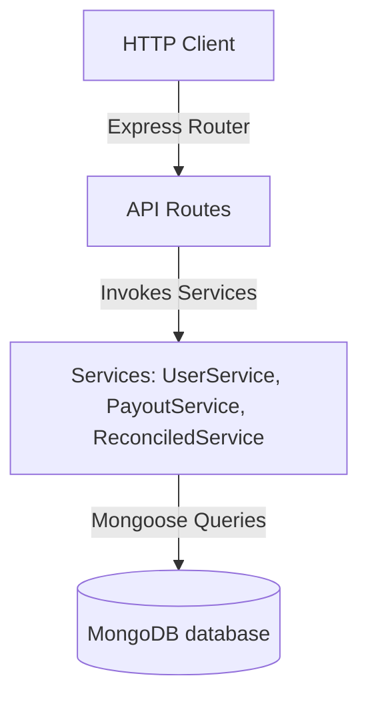
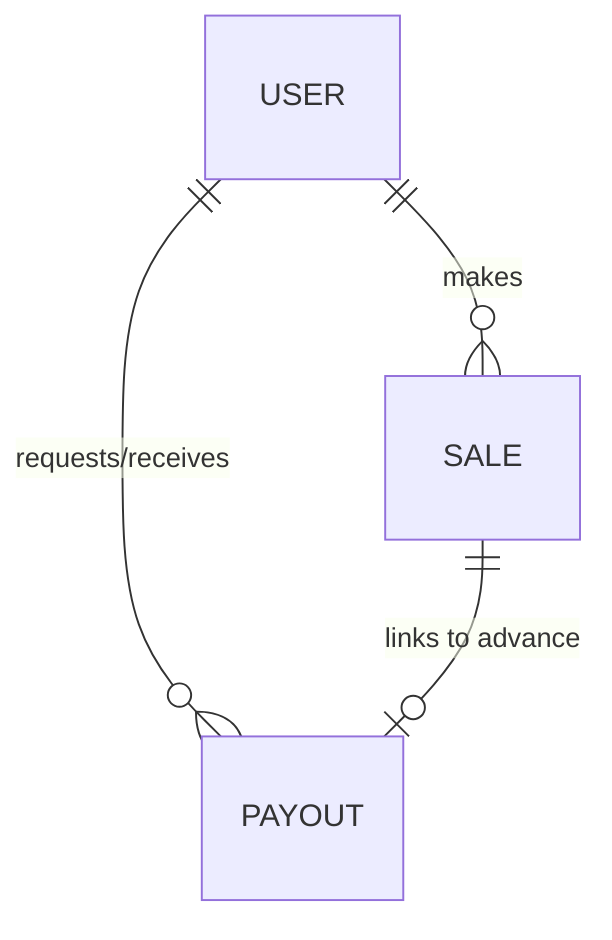
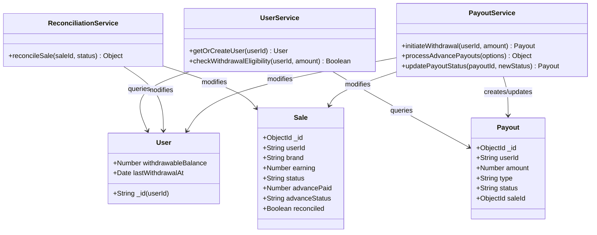
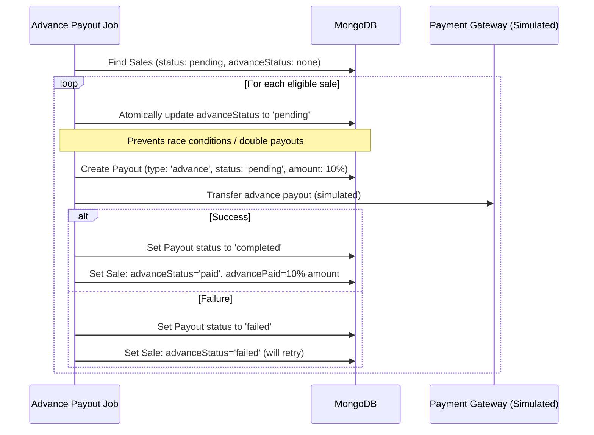
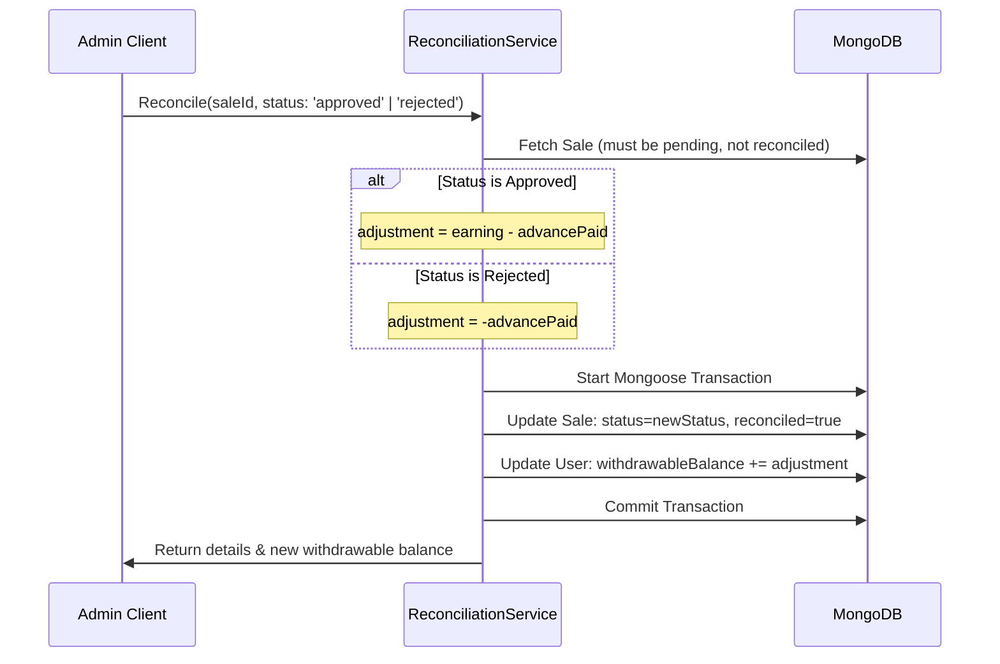
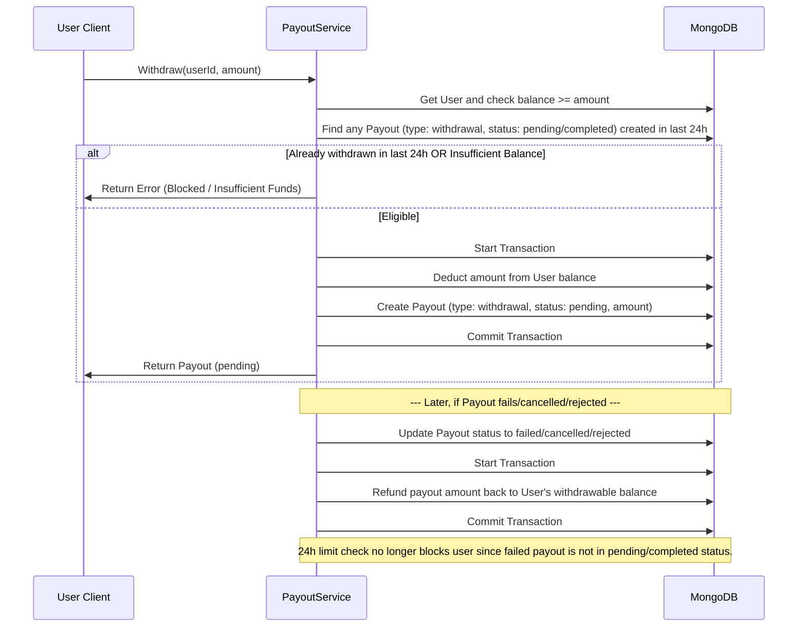

# Low-Level Design (LLD) - User Payout Management System

This document describes the low-level design for the User Payout Management System, implementing the business rules for affiliate sale payouts, advance transfers, 24-hour withdrawal restrictions, and failure recovery.

---

## 1. System Architecture Diagram
The system follows a modular Layered Architecture pattern, separating HTTP/routing logic, core business services, and database persistence layers.



---

## 2. Database Schema Design (Mongoose)

### 2.1 User / Wallet Collection (`users`)
This document stores the wallet and withdrawal state for each user.
```json
{
  "_id": "String (userId, unique e.g., 'john_doe')",
  "withdrawableBalance": "Number (Default: 0, rounded to 2 decimals)",
  "lastWithdrawalAt": "Date (Default: null)",
  "createdAt": "Date",
  "updatedAt": "Date"
}
```

### 2.2 Sale Collection (`sales`)
Tracks affiliate sales, their earnings, advance payout details, and final reconciliation status.
```json
{
  "_id": "ObjectId",
  "userId": "String (Ref: User, Indexed)",
  "brand": "String (e.g., 'brand_1')",
  "earning": "Number (e.g., 40.00)",
  "status": "String ('pending', 'approved', 'rejected' - Default: 'pending')",
  "advancePaid": "Number (Default: 0, actual advance paid)",
  "advanceStatus": "String ('none', 'pending', 'paid', 'failed' - Default: 'none')",
  "reconciled": "Boolean (Default: false, Indexed)",
  "createdAt": "Date",
  "updatedAt": "Date"
}
```

### 2.3 Payout Collection (`payouts`)
Tracks both automated advance payouts and user-requested withdrawals.
```json
{
  "_id": "ObjectId",
  "userId": "String (Ref: User, Indexed)",
  "amount": "Number",
  "type": "String ('advance', 'withdrawal')",
  "status": "String ('pending', 'completed', 'failed', 'cancelled', 'rejected' - Default: 'pending')",
  "saleId": "ObjectId (Ref: Sale, Optional - Null for withdrawals)",
  "createdAt": "Date",
  "updatedAt": "Date"
}
```

### Relationships (Entity-Relationship Diagram)


---

## 3. Class Design & Component Layout

Since this project is implemented in JavaScript (Node.js/Express) which is prototype-based rather than class-based, we model the system using structured services containing clear functions. The logical class design maps as follows:



---

## 4. Key Flow Diagrams

### 4.1 Advance Payout Job Flow (Question 1)
Run in the background or triggered via API. Processes 10% of pending earnings.


### 4.2 Sale Reconciliation Flow (Question 1)
Triggered by admin to update sale status to approved or rejected.


### 4.3 Withdrawal Restrictions & Recovery Flow (Question 2)


---

## 5. Design Decisions & Trade-Offs

### 5.1 Using Natural String Keys for `User._id`
- **Decision**: Set the primary key `_id` of the User schema directly to the string representing `userId` (e.g. `'john_doe'`).
- **Trade-off**: This prevents storing duplicate user documents for the same username and avoids creating separate fields/indexes for `userId` when an auto-generated ObjectID is not strictly required. It makes API paths and database lookups simpler and faster.

### 5.2 Transaction Safety vs Performance
- **Decision**: Use Mongoose/MongoDB transactions (`session.startTransaction()`) during reconciliation and withdrawals.
- **Trade-off**: Transactions guarantee ACID properties. If a system failure or crash occurs after checking a user's eligibility but before writing the withdrawal payout record, the balance deduction is safely rolled back. While transactions introduce slight network overhead, they are essential for critical ledger and wallet systems.

### 5.3 Concurrency Control on Advance Payouts
- **Decision**: Use atomic `findOneAndUpdate` with query conditions (`advanceStatus: 'none'`) when claiming a sale for advance processing.
- **Trade-off**: If the advance payout job is triggered simultaneously from two nodes (e.g. horizontal scaling), only one worker successfully updates `advanceStatus` from `'none'` to `'pending'`. The second worker gets `null` back and skips that sale, avoiding duplicate payout transfers.

### 5.4 Withdrawal Block Definition
- **Decision**: Define the 24-hour withdrawal constraint based on successful (`'completed'`) or open (`'pending'`) withdrawals.
- **Trade-off**: If a withdrawal fails, its status is changed to `'failed'`, `'cancelled'`, or `'rejected'`. This automatically removes it from the "recent withdrawals in last 24 hours" query, clearing the lock on the user's account and satisfying Question 2. No complex scheduler or job is needed to clear locks.
